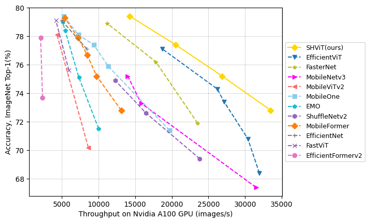

# SHViT: Single-Head Vision Transformer with Memory Efficient Macro Design

This is the official repository of 

[**SHViT: Single-Head Vision Transformer with Memory Efficient Macro Design**](https://arxiv.org/abs/2401.16456)
*Seokju Yun, Youngmin Ro.* CVPR 2024



<details>
  <summary>
  <font size="+1">Abstract</font>
  </summary>
Recently, efficient Vision Transformers have shown great performance with low latency on resource-constrained devices. Conventionally, they use 4x4 patch embeddings and a 4-stage structure at the macro level, while utilizing sophisticated attention with multi-head configuration at the micro level. This paper aims to address computational redundancy at all design levels in a memory-efficient manner. We discover that using larger-stride patchify stem not only reduces memory access costs but also achieves competitive performance by leveraging token representations with reduced spatial redundancy from the early stages. Furthermore, our preliminary analyses suggest that attention layers in the early stages can be substituted with convolutions, and several attention heads in the latter stages are computationally redundant. To handle this, we introduce a single-head attention module that inherently prevents head redundancy and simultaneously boosts accuracy by parallelly combining global and local information. Building upon our solutions, we introduce SHViT, a Single-Head Vision Transformer that obtains the state-of-the-art speed-accuracy tradeoff. For example, on ImageNet-1k, our SHViT-S4 is 3.3x, 8.1x, and 2.4x faster than MobileViTv2 x1.0 on GPU, CPU, and iPhone12 mobile device, respectively, while being 1.3% more accurate. For object detection and instance segmentation on MS COCO using Mask-RCNN head, our model achieves performance comparable to FastViT-SA12 while exhibiting 3.8x and 2.0x lower backbone latency on GPU and mobile device, respectively.
</details>


## Pre-trained Models
| name | resolution | acc | #params | FLOPs | Throughput | model |
|:---:|:---:|:---:|:---:| :---:|:---:|:---:|
| SHViT-S1 | 224x224 | 72.8 | 6.3M | 241M | 33489 |[model](https://github.com/ysj9909/SHViT/releases/download/v1.0/shvit_s1.pth) |
| SHViT-S2 | 224x224 | 75.2 | 11.4M | 366M | 26878 | [model](https://github.com/ysj9909/SHViT/releases/download/v1.0/shvit_s2.pth) |
| SHViT-S3 | 224x224 | 77.4 | 14.2M | 601M | 20522 | [model](https://github.com/ysj9909/SHViT/releases/download/v1.0/shvit_s3.pth) |
| SHViT-S4 | 256x256 | 79.4 | 16.5M | 986M | 14283 | [model](https://github.com/ysj9909/SHViT/releases/download/v1.0/shvit_s4.pth) |


## Training
### Image Classification

#### Setup
```bash
conda create -n shvit python=3.9
conda activate shvit
conda install pytorch==1.11.0 torchvision==0.12.0 torchaudio==0.11.0 cudatoolkit=11.3 -c pytorch
pip install -r requirements.txt
```

#### Dataset Preparation

Download the [ImageNet-1K](http://image-net.org/) dataset and structure the data as follows:
```
/path/to/imagenet-1k/
  train/
    class1/
      img1.jpeg
    class2/
      img2.jpeg
  validation/
    class1/
      img3.jpeg
    class2/
      img4.jpeg
```

To train SHViT models, follow the respective command below:
<details>
<summary>
SHViT-S1
</summary>

```
python -m torch.distributed.launch --nproc_per_node=8 --master_port 12345 --use_env main.py --model shvit_s1 --data-path $PATH_TO_IMAGENET --dist-eval --weight-decay 0.025
```
</details>

<details>
<summary>
SHViT-S2
</summary>

```
python -m torch.distributed.launch --nproc_per_node=8 --master_port 12345 --use_env main.py --model shvit_s2 --data-path $PATH_TO_IMAGENET --dist-eval --weight-decay 0.032
```
</details>

<details>
<summary>
SHViT-S3
</summary>

```
python -m torch.distributed.launch --nproc_per_node=8 --master_port 12345 --use_env main.py --model shvit_s3 --data-path $PATH_TO_IMAGENET --dist-eval --weight-decay 0.035
```
</details>

<details>
<summary>
SHViT-S4
</summary>

```
python -m torch.distributed.launch --nproc_per_node=8 --master_port 12345 --use_env main.py --model shvit_s4 --data-path $PATH_TO_IMAGENET --dist-eval --weight-decay 0.03 --input-size 256
```
</details>


## Evaluation
Run the following command to evaluate a pre-trained SHViT-S4 on ImageNet-1K validation set with a single GPU:
```bash
python main.py --eval --model shvit_s4 --resume ./shvit_s4.pth --data-path $PATH_TO_IMAGENET --input-size 256
```


## Latency Measurement
Run the following command to compare the throughputs on GPU/CPU:

```
python speed_test.py
```

The mobile latency reported in SHViT for iPhone 12 uses the deployment tool from [XCode 14](https://developer.apple.com/videos/play/wwdc2022/10027/).

export the model to Core ML model

```
python export_model.py --variant shvit_s4 --output-dir /path/to/save/exported_model \
--checkpoint /path/to/pretrained_checkpoints/shvit_s4.pth
```

## Citation
If our work or code help your work, please cite our paper:
```
@inproceedings{yun2024shvit,
  author={Yun, Seokju and Ro, Youngmin},
  title={SHViT: Single-Head Vision Transformer with Memory Efficient Macro Design},
  booktitle={Proceedings of the IEEE/CVF Conference on Computer Vision and Pattern Recognition (CVPR)},
  pages={5756--5767},
  year={2024}
}
```

## Acknowledgements
We sincerely appreciate [Swin Transformer](https://github.com/microsoft/swin-transformer), [LeViT](https://github.com/facebookresearch/LeViT), [pytorch-image-models](https://github.com/rwightman/pytorch-image-models), [EfficientViT](https://github.com/microsoft/Cream/tree/main/EfficientViT) and [PyTorch](https://github.com/pytorch/pytorch) for their wonderful implementations.
